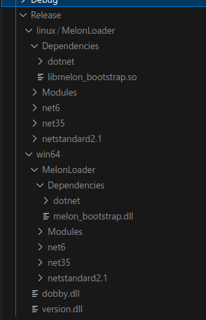

# Building MelonLoader


### Requirements
* Install the [Rust build tools](https://rustup.rs)
* Install the [.NET 6.0 SDK](https://dotnet.microsoft.com/en-us/download/dotnet/6.0)
* (Linux Only) Install mono's msbuild
* (Linux Only) for cross-compilation, install cargo-xwin

## build.py
A python script for convenience is being developed alongside MelonLoader.

```sh
python build.py win64 #will build for win64
```

### Args
* `--release` will compile in release mode.
### Available architectures
* win64
* win32
* linux
* macos (not yet)
* all

an Output folder will be created in the root directory.

## Manually

MelonLoader consists of two parts. The platform native parts, written in Rust, and the C# parts.

to build the rust parts, you can simply type `cargo build`, with the optional `--release` flag.

The available architectures are:

* 64bit Windows: `--target=x86_64-pc-windows-msvc`
* 32bit Windows: `--target=i686-pc-windows-msvc`
* 64bit Linux: `--target=x86_64-unknown-linux-gnu`
* 64bit MacOS (not yet): `--target=x86_64-apple-darwin`

You will find them in the `target/` folder after building.

The C# Project can simply be built with `dotnet build MelonLoader/MelonLoader.sln`, with the optional `--configuration Release` flag.

You can find the built C# files in `MelonLoader/Output/`.

To put MelonLoader together, here are completed folder structures, as they should appear in your game's root directory:



As you can see, `version.dll`, built from Rust is placed in the root directory for windows builds. `dobby.dll` can be found in `BaseLibs`

`melon_bootstrap` must be placed in the Dependencies folder, as must `dotnet` from `BaseLibs`. The dotnet folders are named after their architecture, but must be renamed to `dotnet` when shipping.


